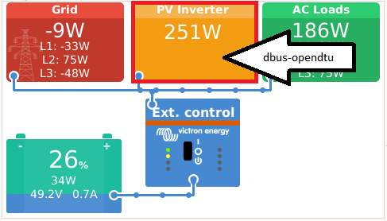
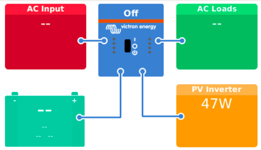
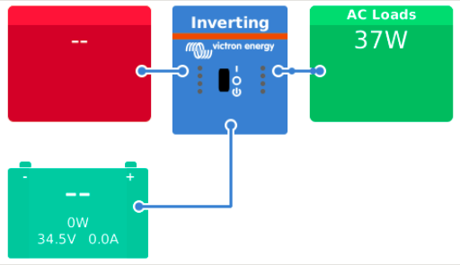
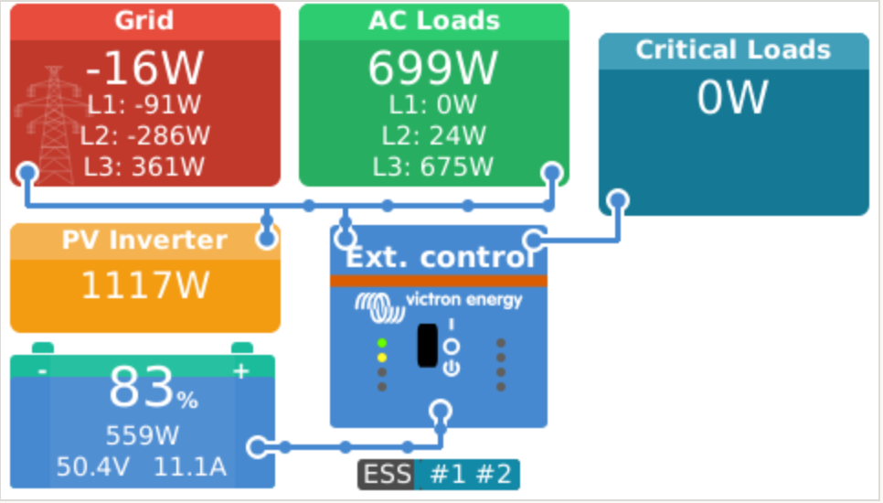
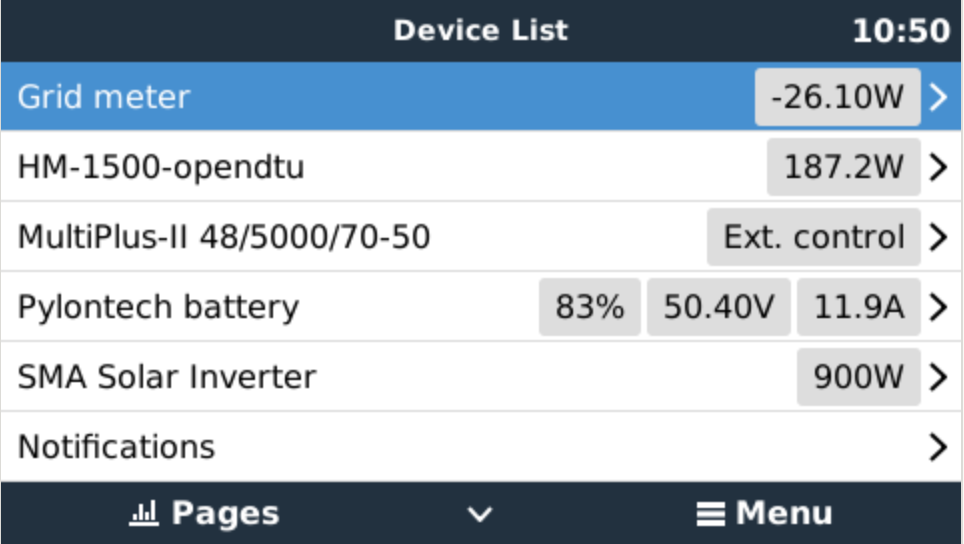
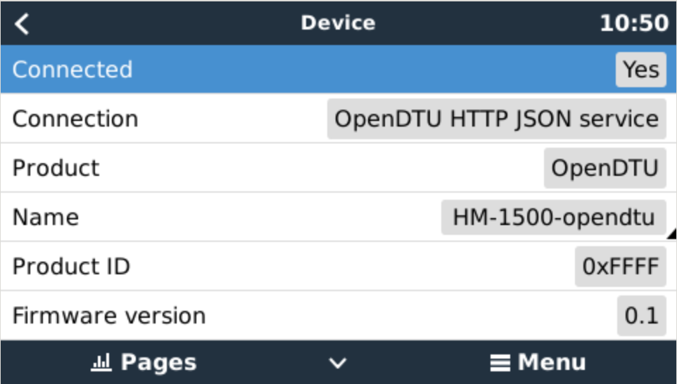
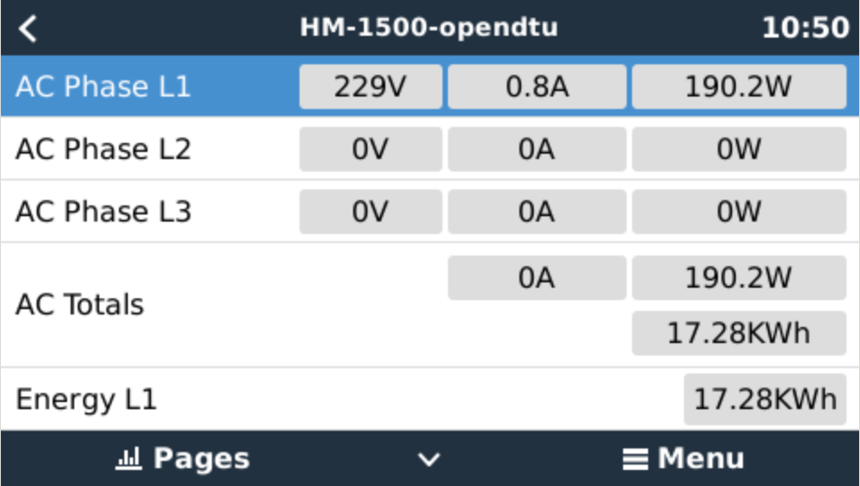

# dbus-opendtu

> **Attention:**
> ⚠️OpenDTU v24.2.12 breaking API changes, do not upgrade to this version, stay on previous version v24.1.26 (latest know working version), until we have updated the code
> ⚠️For any problems with OpenDTU prior v4.4.3 version, please update to the latest code where most Issues are fixed. OpenDTU changed the API. The same applies to AhoyDTU.⚠️

## Table of contents

* [Introduction](#introduction)
* [Installation](#installation)
  * [Get the code](#get-the-code)
  * [Configuration](#configuration)
    * [Default options](#default-options)
    * [Inverter options](#inverter-options)
    * [Template options](#template-options)
  * [Service names](#service-names)
  * [Videos how to install](#videos-how-to-install)
  * [Use Cases](#use-cases)
    * [Use Case 1: Using a Pv Inverter](#use-case-1-use-a-pv-inverter)
    * [Use Case 2: Using a (Battery) Inverter](#use-case-2-use-a-battery-inverter)
* [Usage](#usage)
  * [Check if script is running](#check-if-script-is-running)
  * [How to debug](#how-to-debug)
  * [How to install](#how-to-install)
  * [How to restart](#how-to-restart)
  * [How to uninstall](#how-to-uninstall)
* [How does it work](#how-does-it-work)
  * [Pictures](#pictures)
* [Tested Devices](#tested-devices)
* [Troubleshooting](#troubleshooting)
  * [Security settings in OpenDTU](#security-settings-in-opendtu)
* [Inspiration](#inspiration)
* [Furher reading](#further-reading)
  * [used documentation](#used-documentation)
  * [Discussions on the web](#discussions-on-the-web)

---

## Introduction

This project integrates (supported) Hoymiles Inverter into Victron Energy's (Venus OS) ecosystem.
It works upon [openDTU](https://github.com/tbnobody/OpenDTU) respectively [AhoyDTU](https://github.com/lumapu/ahoy) and also with other generic REST Devices (template configuration needed to include them).



---

## Installation

With the scripts in this repo, it should be easy possible to install, uninstall, restart a service that connects the OpenDTU or Ahoy to the VenusOS and GX devices from Victron.

### Get the code

Just grap a copy of the main branch and copy the content to `/data/` e.g. `/data/dbus-opendtu`.
After that call the `install.sh script.

The following commands should do everything for you:

```bash
wget -O main.zip https://github.com/henne49/dbus-opendtu/archive/refs/heads/main.zip
unzip main.zip "dbus-opendtu-main/*" -d /data
mv /data/dbus-opendtu-main /data/dbus-opendtu
chmod a+x /data/dbus-opendtu/install.sh
```

⚠️**Edit the following configuration file according to your needs before proceeding**⚠️ see [Configuration](#configuration) for details.

```bash
nano /data/dbus-opendtu/config.ini
```

Tha last step is to install the service and remove the downloaded files:

```bash
/data/dbus-opendtu/install.sh
rm main.zip
```

Check configuration after that - because the service is already installed and running. In case of wrong connection data (host, username, pwd) you will spam the log-file! Also, check to **set a** proper (minimal) **log level**

### Configuration

Within the project there is a file `/data/dbus-opendtu/config.ini`. Most important is the DTU variant, Host and Username and Password, if you use authentication.

#### Default options

| Config value        | Explanation   |
|-------------------- | ------------- |
| SignOfLifeLog  | Time in minutes how often a status is added to the log-file `current.log` with log-level INFO |
| NumberOfTemplates | Number ob Template Inverter to query |
| DTU |  Which DTU to be used ahoy, opendtu or template REST devices Valid options: opendtu, ahoy, template |
| useYieldDay | send YieldDay instead of YieldTotal. Set this to 1 to prevent VRM from adding the total value to the history on one day. E.g. if you don't start using the inverter at 0. |
| ESP8266PollingIntervall |  For ESP8266 reduce polling intervall to reduce load, default 10000ms|
| Logging | Valid options for log level: CRITICAL, ERROR, WARNING, INFO, DEBUG, NOTSET, to keep logfile small use ERROR or CRITICAL |
 MaxAgeTsLastSuccess | Maximum accepted age of ts_last_success in Ahoy status message. If ts_last_success is older than this number of seconds, values are not used.  Set this to < 0 to disable this check.                                    |
| DryRun | Set this to a value different to "0" to prevent values from being sent. Use this for debugging or experiments. |
| Host | IP or hostname of ahoy or OpenDTU API/web-interface |
| HTTPTimeout | Timeout when doing the HTTP request to the DTU or template. Default: 2.5 sec |
| Username | use if authentication required, leave empty if no authentication needed |
| Password | use if authentication required, leave empty if no authentication needed |

#### Inverter options

This applies to each `INVERTER[X]` section. X is the number of Inverter starting with 0. So the first inverter is INVERTER0, the second INVERTER1 and so on.

| Config value        | Explanation   |
|-------------------- | ------------- |
| Phase | which Phase L1, L2, L3 to show; use 3P for three-phase-inverters *1 |
| DeviceInstance | Unique ID identifying the OpenDTU in Venus OS|
| AcPosition | Position shown in Remote Console (0=AC input 1; 1=AC output; 2=AC input 2) |
| Servicename | e.g. com.victronenergy.pvinverter see [Service names](#service-names) |

*1: Use 3P to split power equally over three phases (use this for Hoymiles three-phase micro-inverters as they report total power only, not seperated by phase).

#### Template options

This applies to each `TEMPLATE[X]` section. X is the number of Template starting with 0. So the first template is TEMPLATE0, the second TEMPLATE1 and so on.

| Config value        | Explanation   |
|-------------------- | ------------- |
| Host | IP or hostname of Template API/web-interface |
| Username | use if authentication required, leave empty if no authentication needed |
| Password | use if authentication required, leave empty if no authentication needed |
| DigestAuth | TRUE if authentication is required using Digest Auth, as for Shelly Plus Devices, False if you Basic Auth to be used|
| CUST_SN | Serialnumber to register device in VenusOS|
| CUST_API_PATH | Location of REST API Path for JSON to be used |
| CUST_POLLING | Polling interval in ms for Device |
| CUST_Total | Path in JSON where to find total Energy |
| CUST_Total_Mult | Multiplier to convert W per minute for example in kWh|
| CUST_Total_Default | [optional] Default value if no value is found in JSON |
| CUST_Power | Path in JSON where to find actual Power |
| CUST_Power_Mult | Multiplier to convert W in negative or positive |
| CUST_Power_Default | [optional] Default value if no value is found in JSON |
| CUST_Voltage | Path in JSON where to find actual Voltage |
| CUST_Voltage_Default | [optional] Default value if no value is found in JSON |
| CUST_Current | Path in JSON where to find actual Current |
| CUST_Current_Default | [optional] Default value if no value is found in JSON |
| CUST_DCVoltage | Path in JSON where to find actual DC Voltage (e.g. Batterie voltage) *2|
| CUST_DCVoltage_Default | [optional] Default value if no value is found in JSON |
| Phase | which Phase L1, L2, L3 to show; use 3P for three-phase-inverters *3 |
| DeviceInstance | Unique ID identifying the OpenDTU in Venus OS|
| AcPosition | Position shown in Remote Console (0=AC input 1; 1=AC output; 2=AC input 2 please do not use) |
| Name | Name to be shown in VenusOS, use a descriptive name |
| Servicename | e.g. com.victronenergy.pvinverter see [Service names](#service-names) |

Example for JSON PATH: use keywords separated by /

*2: is only used if Servicename is com.victronenergy.inverter
*3: Use 3P to split power equally over three phases (use this for Hoymiles three-phase micro-inverters as they report total power only, not seperated by phase).

### Service names

The following servicenames are supported:

* com.victronenergy.pvinverter
* com.victronenergy.inverter (non-PV - see below)
* others might work but are not tested or undocumented yet

**Note: Non-PV inverters are BETA! The functionality will be limited** (due to limited understanding of Victrons/Venus's behavior).

The difference between the two is that the first one (com.victronenergy.pvinverter) is used as a PV inverter connected to PV and the grid (like a Fronius or SMA inverter).
The second one (com.victronenergy.inverter) is used for a battery inverter like a Victron AC inverter and is - from Victron's view - not connected to the grid.
For more Information about non-PV inverters, see this [Issue #42](https://github.com/henne49/dbus-opendtu/issues/42).
Also, please note the use case about non-PV inverters below.

It is possible that other servicenames are supported, but they have not been tested by us. If you have a device with a different servicename, please open an issue. Any help or research is welcome and appreciated.
  
### Videos how to install

Here are some videos on how to install and use the script. They are in German, but you can use subtitles and auto-translate to your language.
*(Don't be confused that the config they used is not the up-to-date.)*

* <https://youtu.be/PpjCz33pGkk> Meine Energiewende
* <https://youtu.be/UNuIOa72eP4> Schatten PV

### Use Cases

In this section we describe some use cases and how to configure the script for them.

#### **Use case 1: Use a PV inverter**

In order to use a PV inverter, you need to know the IP address of the DTU (in my case Ahoy) and the servicename of the PV-Inverter. The servicename is `com.victronenergy.pvinverter`.

A Basic configuration could look like this:

```ini
[DEFAULT]
# Which DTU to be used ahoy, opendtu, template
DTU=ahoy

#Possible Options for Log Level: CRITICAL, ERROR, WARNING, INFO, DEBUG, NOTSET
#To keep current.log small use ERROR
Logging=ERROR

#IP of Device to query <-- THIS IS THE IP OF THE DTU
Host=192.168.1.74

### Ahoy Inverter
# AcPosition 0=AC input 1; 1=AC output; 2=AC output 2
# 1st inverter
[INVERTER0]
Phase=L1
DeviceInstance=34
AcPosition=0
```

The result will be that the first inverter is shown in the Remote Console of Venus OS.



#### **Use case 2: Use a battery inverter**

**NOTE: BETA - Victron never intended to use a Non-PV inverter (besides Multiplus, Quattro, etc.) to be connected to the existing grid directly (Grid synchronization).**

In order to use a battery inverter, you need to know the IP address of the DTU (in my case Ahoy) and the servicename of the battery inverter. The servicename is `com.victronenergy.inverter`.

The term battery inverter is used for a device that is connected to the grid and can discharge a battery. This is different from a PV inverter, which is only connected to PV-Modules and feeds in energy.

You might want to use a battery inverter to use a battery to store energy from an MPPT charger / AC charger etc. and use it later.

A Basic configuration could look like this:

```ini
[DEFAULT]
# Which DTU to be used ahoy, opendtu, template
DTU=ahoy

#Possible Options for Log Level: CRITICAL, ERROR, WARNING, INFO, DEBUG, NOTSET
#To keep current.log small use ERROR
Logging=ERROR

#IP of Device to query <-- THIS IS THE IP OF THE DTU
Host=192.168.1.74

### Ahoy Inverter
# AcPosition 0=AC input 1; 1=AC output; 2=AC output 2
# 1st inverter
[INVERTER0]
Phase=L1
DeviceInstance=34
AcPosition=0
Servicename=com.victronenergy.inverter
```

The Result looks like this:



---

## Usage

These are some useful commands which help to use the script or to debug.

### Check if the script is running

`svstat /service/dbus-opendtu` show if the service (our script) is running. If the number of seconds shown is low, it is probably restarting and you should look into `/data/dbus-opendtu/current.log`.

### How to debug

`dbus-spy` show all DBus values interactively.

This is useful to check if the script is running and sending values to Venus OS.

### How to install

`/data/dbus-opendtu/install.sh` installs the service persistently (see above).

This also activates the service, so you don't need to run `svcadm enable /service/dbus-opendtu` manually.

### How to restart

`/data/dbus-opendtu/restart.sh` restarts the service - e.g. after a config.ini change.

This also clears the logfile, so you can see the latest output in `/data/dbus-opendtu/current.log`.

### How to uninstall

`/data/dbus-opendtu/uninstall.sh` stops the service and prevents it from being restarted (e.g. after a reboot).

If you want to remove the service completely, you can do so by running `rm -rf /data/dbus-opendtu`.

---

## How does it work

The script is inspired by @fabian-lauer dbus-shelly-3em-smartmeter implementation. So what is the script doing:

* Running as a service
* Connecting to DBus of the Venus OS `com.victronenergy.pvinverter.http_{DeviceInstanceID_from_config}`
* After successful DBus connection, OpenDTU (resp. Ahoy) is accessed via REST-API - simply the `/status` (resp. `api/live`) is called which returns a JSON with all details.
  * A sample JSON file from OpenDTU can be found [here](docs/OpenDTU.json).
  * A sample JSON file from Ahoy can be found [here](docs/ahoy_0.6.9_live.json)
* Serial/devicename is taken from the response as device serial
* Paths are added to the DBus with default value 0 - including some settings like name etc.
* After that, a "loop" is started which pulls OpenDTU/AhoyDTU data every 5s (configurable) from the REST-API and updates the values in the DBus, for ESP 8266 based ahoy systems we even pull data only every 10seconds.

Thats it 😄

### Pictures

 
 

---

## Tested Devices

The code allows you to query either an Ahoy or OpenDTU Device, plus multiple template based (PV) Inverter in a single script.

Following combinations are possible:

* Use one or more devices configured via template configuration
* Use a OpenDTU device
* Use a AhoyDTU device
* Use either a OpenDTU or a AhoyDTU device and one or more template devices.

Tested examples for template devices:

* Tasmota unauthenticated
* Shelly 1 PM authenticated/unauthenticated
* Shelly Plus 1 PM unathenticated

All [configuration](#configuration) is done via config.ini. Examples are commented in config.ini

---

## Troubleshooting

Please open a new issue on github, only here we can work on your problem in a structured way: <https://github.com/henne49/dbus-opendtu/issues/new/choose>

⚠️ **Change the Logging Parameter under DEFAULT in /data/dbus-opendtu/config.ini to Logging = DEBUG, please revert, once debugging and troubleshooting is complete. Rerun the script and share the current.log file**.

Please provide the config.ini and JSON file and upload to the github issues, you can download the JSON file using your browser or using a commandline like tool like curl

| Type of DTU | URL |
| ------------- | ------------- |
| OpenDTU | <http://REPLACE_WITH_YOUR_IP_OR_HOSTNAME/api/livedata/status> |
| Ahoy | <http://REPLACE_WITH_YOUR_IP_OR_HOSTNAME/api/live> |
| Template Tasmota| <http://REPLACE_WITH_YOUR_IP_OR_HOSTNAME/cm?cmnd=STATUS+8> |
| Template Shelly 1 | <http://REPLACE_WITH_YOUR_IP_OR_HOSTNAME/status> |
| Template Shelly Plus | <http://REPLACE_WITH_YOUR_IP_OR_HOSTNAME/rpc/Switch.GetStatus?id=0> |
| Template Your Own | You will know best|

OpenDTU Curl example which uses jq to make the output pretty:

```bash
curl http://REPLACE_WITH_YOUR_IP_OR_HOSTNAME/api/livedata/status | jq > export.json
```

also describe the problem as best as you can.

Please also show, what you can see in Venus OS and VRM Portal, as the source of truth is Venus OS and not VRM.

### Security settings in OpenDTU

For openDTU, you can use authentication for the web Interface, but allow access to the status page unauthenticated. For this please use the settings like below.


---

## Inspiration

Idea is inspired on @fabian-lauer & @vikt0rm project linked below.
This project is my first on GitHub and with the Victron Venus OS, so I took some ideas and approaches from the following projects - many thanks for sharing the knowledge:

* [dbus-shelly-3em-smartmeter](https://github.com/fabian-lauer/dbus-shelly-3em-smartmeter)
* [shelly-api-docs](https://shelly-api-docs.shelly.cloud/gen1/#shelly1-shelly1pm)
* [Victron Wiki](https://github.com/victronenergy/venus/wiki/dbus#pv-inverters)
* [dbus-shelly-1pm-pvinverter](https://github.com/vikt0rm/dbus-shelly-1pm-pvinverter)
* [OpenDTU](https://github.com/tbnobody/OpenDTU )
* [OpenDTU Web-API Docs](https://github.com/tbnobody/OpenDTU/blob/master/docs/Web-API.md)
* [AhoyDTU](https://ahoydtu.de/)
* [AhoyDTU git](https://github.com/lumapu/ahoy)

---

## Further reading

If you like to read more about the Venus OS and the DBus, please check the following links and sites.

### used Documentation

* [DBus paths for Victron namespace](https://github.com/victronenergy/venus/wiki/dbus#pv-inverters)
* [DBus API from Victron](https://github.com/victronenergy/venus/wiki/dbus-api)
* [How to get root access on GX device/Venus OS](https://www.victronenergy.com/live/ccgx:root_access)
* [OpenDTU Web-API](https://github.com/tbnobody/OpenDTU/blob/master/docs/Web-API.md)

### Discussions on the web

This module/repository has been posted on the following threads:

* [Community Victronenergy](https://community.victronenergy.com/questions/169076/opendtu-as-pv-inverter-in-venusos.html)
