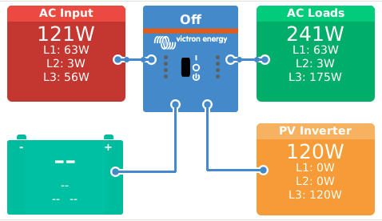
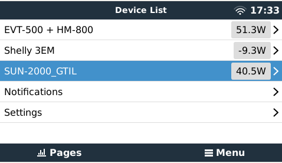
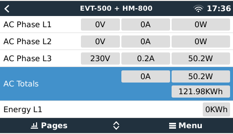
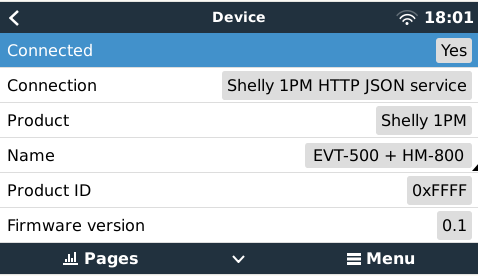

# dbus-opendtu inverter
Integrate opendtu https://github.com/tbnobody/OpenDTU into Victron Energies Venus OS

## Purpose
With the scripts in this repo it should be easy possible to install, uninstall, restart a service that connects the opendtu to the VenusOS and GX devices from Victron.
Idea is inspired on @fabian-lauer & @vikt0rm project linked below.


## Inspiration
This project is my first on GitHub and with the Victron Venus OS, so I took some ideas and approaches from the following projects - many thanks for sharing the knowledge:
- https://github.com/fabian-lauer/dbus-shelly-3em-smartmeter
- https://shelly-api-docs.shelly.cloud/gen1/#shelly1-shelly1pm
- https://github.com/victronenergy/venus/wiki/dbus#pv-inverters
- https://github.com/tbnobody/OpenDTU 
- https://github.com/vikt0rm

## How it works


### Details / Process
As mentioned above the script is inspired by @fabian-lauer dbus-shelly-3em-smartmeter implementation.
So what is the script doing:
- Running as a service
- connecting to DBus of the Venus OS `com.victronenergy.pvinverter.http_{DeviceInstanceID_from_config}`
- After successful DBus connection OpenDTU is accessed via REST-API - simply the /status is called and a JSON is returned with all details
  A sample JSON file from OpenDTU can be found [here](docs/OpenDTU.json)
- Serial/MAC is taken from the response as device serial
- Paths are added to the DBus with default value 0 - including some settings like name, etc
- After that a "loop" is started which pulls OpenDTU data every 750ms from the REST-API and updates the values in the DBus

Thats it 😄

### Pictures

 




## Install & Configuration
### Get the code
Just grap a copy of the main branche and copy them to a folder under `/data/` e.g. `/data/dbus-opendtu`.
After that call the install.sh script.

The following script should do everything for you:
```
wget https://github.com/vikt0rm/dbus-shelly-1pm-pvinverter/archive/refs/heads/main.zip
unzip main.zip "dbus-shelly-1pm-pvinverter-main/*" -d /data
mv /data/dbus-shelly-1pm-pvinverter-main /data/dbus-shelly-1pm-pvinverter
chmod a+x /data/dbus-shelly-1pm-pvinverter/install.sh
/data/dbus-shelly-1pm-pvinverter/install.sh
rm main.zip
```
⚠️ Check configuration after that - because service is already installed an running and with wrong connection data (host, username, pwd) you will spam the log-file

### Change config.ini
Within the project there is a file `/data/dbus-shelly-1pm-pvinverter/config.ini` - just change the values - most important is the deviceinstance, custom name and phase under "DEFAULT" and host, username and password in section "ONPREMISE". More details below:

| Section  | Config vlaue | Explanation |
| ------------- | ------------- | ------------- |
| DEFAULT  | AccessType | Fixed value 'OnPremise' |
| DEFAULT  | SignOfLifeLog  | Time in minutes how often a status is added to the log-file `current.log` with log-level INFO |
| DEFAULT  | Deviceinstance | Unique ID identifying the shelly 1pm in Venus OS |
| DEFAULT  | CustomName | Name shown in Remote Console (e.g. name of pv inverter) |
| DEFAULT  | Phase | Valid values L1, L2 or L3: represents the phase where pv inverter is feeding in |
| ONPREMISE  | Host | IP or hostname of on-premise Shelly 3EM web-interface |
| ONPREMISE  | Username | Username for htaccess login - leave blank if no username/password required |
| ONPREMISE  | Password | Password for htaccess login - leave blank if no username/password required |


## Used documentation
- https://github.com/victronenergy/venus/wiki/dbus#pv-inverters   DBus paths for Victron namespace
- https://github.com/victronenergy/venus/wiki/dbus-api   DBus API from Victron
- https://www.victronenergy.com/live/ccgx:root_access   How to get root access on GX device/Venus OS
- https://github.com/tbnobody/OpenDTU/blob/master/docs/Web-API.md

## Discussions on the web
This module/repository has been posted on the following threads:
- 
